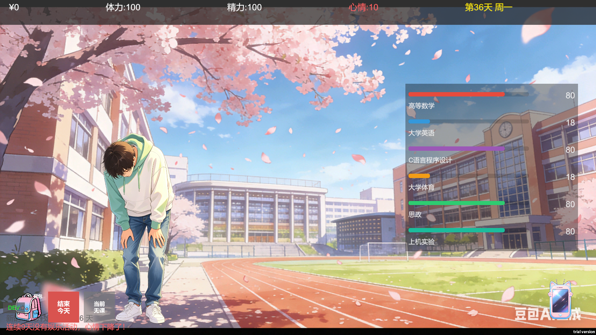
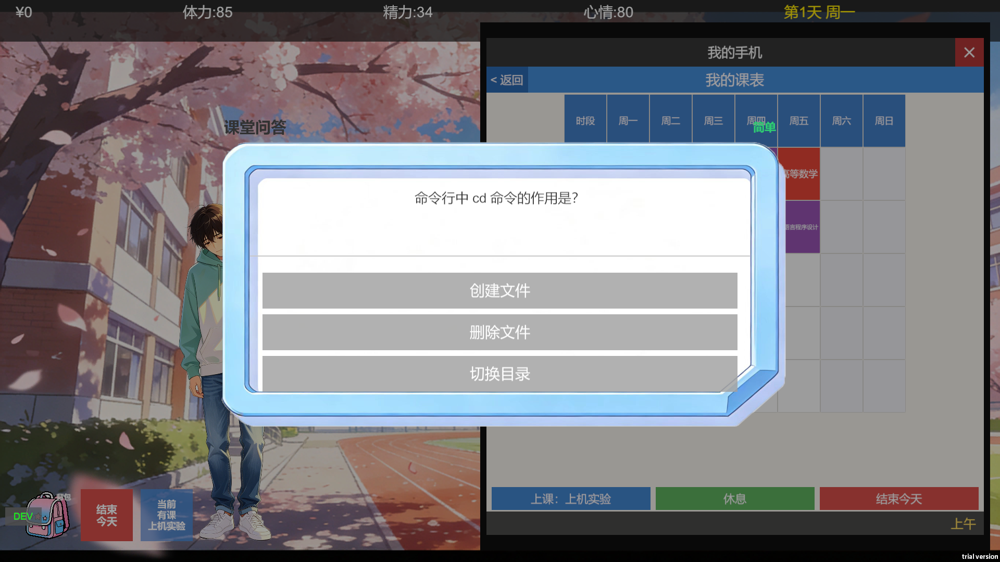
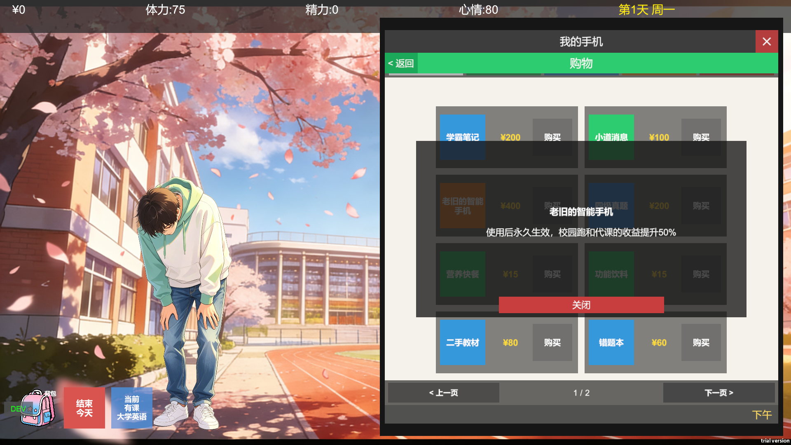
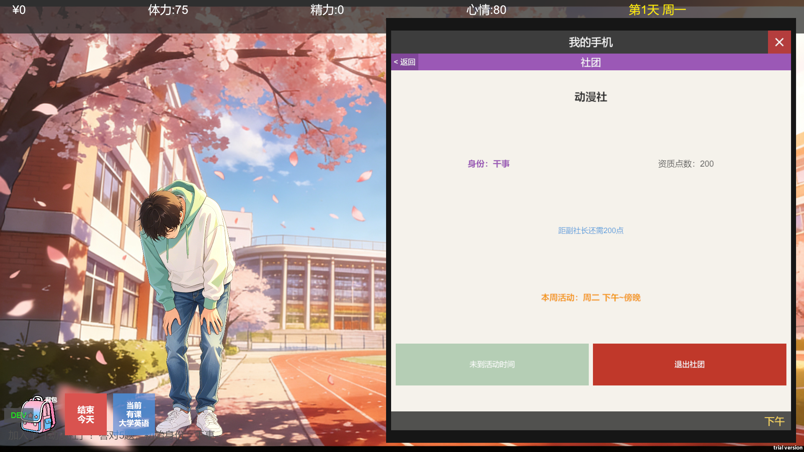
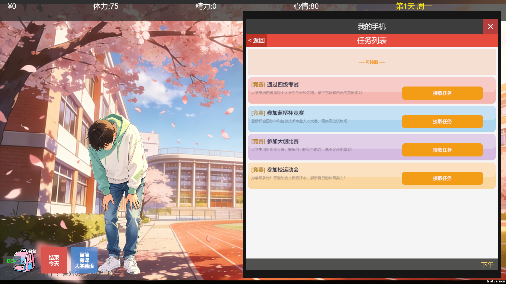
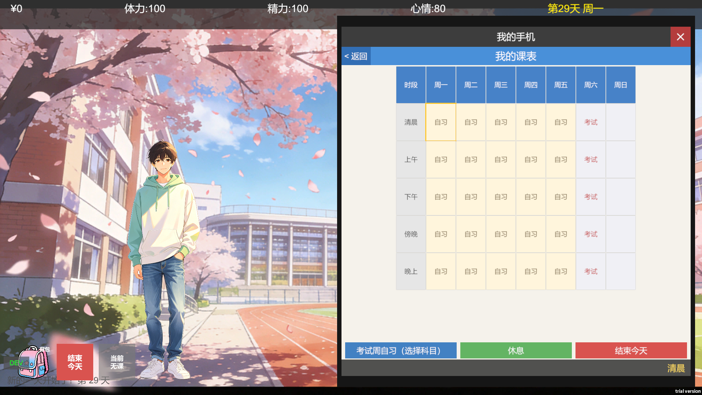
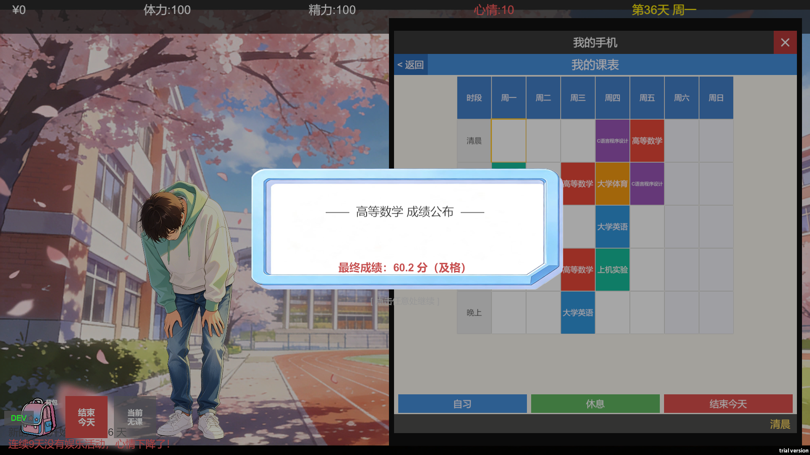

# 大学副业模拟器 · College Side Hustle Simulator

> 一款 Unity 2D 校园生活模拟游戏 —— 在 36 天内平衡学业、打工、社团与考试，**架构与代码 90% 由 AI 协作完成**。

<p align="center">
  
  
  
  
  
  
</p>


---

## ✨ 项目简介

玩家扮演一名大学新生，在 **36 天** 的校园生活中通过 **上课、打工、购物、社团、任务** 等行为，平衡 **金钱 / 体力 / 精力 / 学业** 四大资源，最终迎接 **考试周** 与 **成绩公布** 的双重审判。

整个项目从架构设计、代码实现、内容填充到 Bug 调试，**几乎全部由 [Claude Code](https://claude.com/claude-code) + [MCP-Unity](https://github.com/CoderGamester/mcp-unity) 协作完成**，是一次完整的 "AI 驱动游戏开发" 实践。

---

## 📸 游戏截图

<p align="center">
  <br>
  <i>主界面 · 顶部状态栏 + 手机式导航</i>
</p>


<table>
  <tr>
    <td align="center">
      <br>
      <sub>课表 & 上课答题</sub>
    </td>
    <td align="center">
      <br>
      <sub>商店 & 背包</sub>
    </td>
  </tr>
  <tr>
    <td align="center">
      <br>
      <sub>社团活动</sub>
    </td>
    <td align="center">
      <br>
      <sub>任务系统</sub>
    </td>
  </tr>
  <tr>
    <td align="center">
      <br>
      <sub>考试周复习</sub>
    </td>
    <td align="center">
      <br>
      <sub>成绩公布</sub>
    </td>
  </tr>
</table>

---

## 🎮 核心玩法

- 🕐 **时段系统**：清晨 → 上午 → 下午 → 傍晚 → 晚上 → 深夜，每天 6 时段自由分配
- 📱 **手机式 UI**：课表 / 社团 / 商店 / 背包 / 任务 五大子页面
- 📚 **课程与考试**：6 门课、3 难度题库，平时分 + 卷面分双维度计算最终成绩
- 💼 **打工系统**：多种兼职 + 随机事件，金钱与体力的博弈
- 🎭 **社团活动**：入社答题、活动选项、缺席判定
- 🛒 **道具商店**：8 种道具（提神咖啡、速成课视频、微型耳机……）配合考试周策略
- 📋 **任务系统**：可同时接取多任务，第 22 天统一结算
- 📝 **考试周**：复习 → 6 科连考 → 作弊风波链 → 成绩公布的完整高潮剧情

### 游戏时间线

| 阶段     | 天数    | 内容                        |
| -------- | ------- | --------------------------- |
| 日常期   | 1 ~ 21  | 上课 / 打工 / 社团 / 接任务 |
| 任务结算 | 22      | 任务统一结算                |
| 缓冲期   | 23 ~ 28 | 自由活动                    |
| 复习周   | 29 ~ 33 | 课表清空，自由选课自习      |
| 考试日   | 34      | 6 门课连续考试，每门 7 题   |
| 出分日   | 36      | 链式对话框逐门公布最终成绩  |

---

## 🏗️ 技术架构

```
┌─────────────────────────────────────────────────┐
│                  UI 层（View）                  │
│  PhoneUI · ClassPageUI · ShopPageUI · BagUI ... │
└────────────────────────┬────────────────────────┘
                         │ C# event 总线
┌────────────────────────┴────────────────────────┐
│              Manager 层（Singleton）             │
│  GameManager · ScheduleManager · BagManager ... │
└────────────────────────┬────────────────────────┘
                         │ 反序列化
┌────────────────────────┴────────────────────────┐
│           Data 层（纯数据 / JSON 配置）          │
│  PlayerData · CourseInfo · ItemDef · ...        │
└─────────────────────────────────────────────────┘
```

### 关键设计

| 设计            | 实现                                                         |
| --------------- | ------------------------------------------------------------ |
| **数据驱动**    | 所有题库 / 事件 / 道具 / 任务全部走 `Resources/Data/*.json`，零硬编码 |
| **代码生成 UI** | `Editor/SceneSetupEditor.cs` 一键生成全部 Canvas，避免手工拖拽 |
| **事件总线**    | `OnPlayerDataChanged` / `OnBagChanged` 等 C# event 解耦 UI 与逻辑 |
| **链式对话框**  | 递归 Action 回调驱动多段剧情（成绩公布、作弊链）             |
| **状态机**      | `ScheduleManager.CheatStage` 驱动作弊风波多分支              |
| **回调安全**    | 对话框关闭前先存局部变量再清空字段，防止同步回调被覆盖       |

### 数值算法亮点

**考试分增长**（三段衰减模拟真实学习曲线）：

```
增长 = 基础分 × 努力系数(0.5~2.0) × 难度衰减系数
难度衰减：0~60 分 1.0→0.65 | 60~85 分 0.4→0.12 | 85~100 分 0.08→0.01
```

**最终成绩**：

```
最终成绩 = 总分(平时分 + 考试分) × 0.7 + 卷面分(考试答题) × 0.3
```

---

## 📂 目录结构

```
Assets/
├── Editor/
│   └── SceneSetupEditor.cs       ← 一键生成全部 UI + 挂载脚本
├── Scripts/
│   ├── Data/                     ← 纯数据定义 + JSON 反序列化
│   ├── Manager/                  ← 单例业务管理器
│   └── UI/                       ← UI 控制器
└── Resources/
    ├── Data/                     ← 全部游戏内容 JSON
    │   ├── quiz_questions.json   ← 6 门课题库
    │   ├── class_events.json     ← 上课 / 自习 / 逃课事件
    │   ├── exam_week_events.json ← 考试周随机事件
    │   ├── items.json            ← 商店道具
    │   ├── clubs.json            ← 社团信息 + 入社题库
    │   ├── missions.json         ← 任务定义
    │   └── ...
    └── 校园1/2/3.jpg             ← 背景图
```

---

## 🤖 AI 编程实践

本项目最大的特色是 **全流程 AI 协作开发**。下面记录这一次实践沉淀下来的方法论。

### 工具链

- **[Claude Code](https://claude.com/claude-code)** —— 主要编码代理，负责架构、代码、文档
- **[MCP-Unity](https://github.com/CoderGamester/mcp-unity)** —— 让 AI 直接调用 Unity Editor 的 30+ 工具：
  - `get_console_logs` —— 实时读取 Console 错误
  - `recompile_scripts` —— 触发编译
  - `get_gameobject` / `update_component` —— 检视与修改场景
  - `run_tests` —— 执行测试
- **`CLAUDE.md`** —— 项目级 AI 规范文件，沉淀"数据驱动 / UI 代码生成 / 对话框回调安全"等铁律

### AI 在每个环节承担的工作

| 环节     | AI 工作                                         |
| -------- | ----------------------------------------------- |
| 需求拆解 | 大纲 → 系统模块 → 任务拆分                      |
| 架构设计 | 提出"数据驱动 + 单例 Manager + 代码生成 UI"方案 |
| 代码生成 | Manager / UI / Data 三层全部由 AI 编写          |
| 内容生产 | 6 门课题库、20+ 上课事件、道具描述均由 AI 产出  |
| Bug 调试 | MCP 直接读 Console → 定位 → 修复 → 重新编译     |
| 文档同步 | 修改代码同时更新 `PROJECT_GUIDE.md`             |

### 协作方法论

1. **规范先行**：`CLAUDE.md` 明确铁律，避免 AI 跨会话漂移
2. **小步快跑**：每个系统单独验证，避免大段不可调试代码
3. **AI 自检闭环**：`recompile_scripts` + `get_console_logs` 让 AI 自验证
4. **人类把关**：架构决策与玩法手感由人定，AI 负责实现与重复劳动
5. **文档即代码**：要求 AI 改代码必须同步更新 `PROJECT_GUIDE.md`，杜绝文档腐烂

---

## 🚀 快速开始

### 环境要求

- Unity 2022.3 LTS 或更高
- TextMeshPro（已内置）

### 运行步骤

```bash
# 1. 克隆仓库
git clone <repo-url>

# 2. 用 Unity Hub 打开项目目录
# 3. Unity 菜单：Tools → 生成游戏场景
# 4. 点击 ▶ Play
```

> ⚠️ 不要在 Unity Scene 中手动改 UI —— `Tools → 生成游戏场景` 会重新覆盖。
> 如需修改布局，请编辑 `Assets/Editor/SceneSetupEditor.cs`。

---

## 📊 项目数据

- **代码规模**：30+ C# 脚本，7 个 Manager + 12 个 UI 控制器
- **内容规模**：6 门课题库 / 8 种道具 / 20+ 上课事件 / 6 个考试周事件 / 完整作弊链
- **数据驱动**：9 个 JSON 配置文件覆盖全部可变内容
- **开发模式**：人类提需求 + AI 写实现 + AI 自验证，全程对话驱动

---

## 📜 License

本项目仅作个人学习与作品集展示用途。

---

<p align="center">
  <i>Built with ❤️ and 🤖 — A practice of AI-driven game development.</i>
</p>

